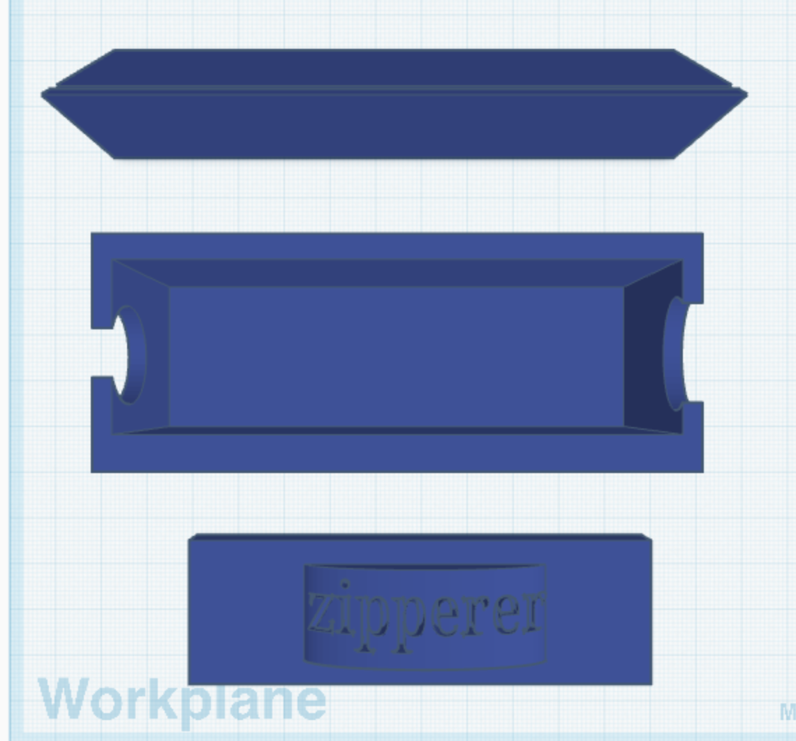
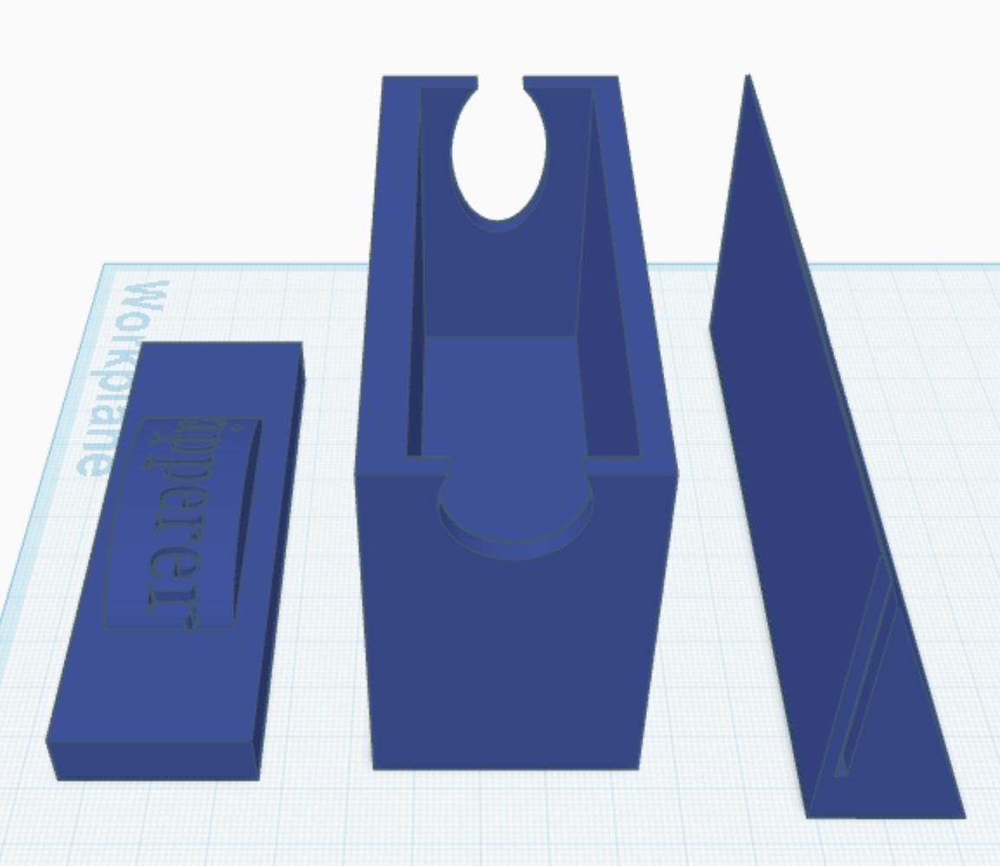
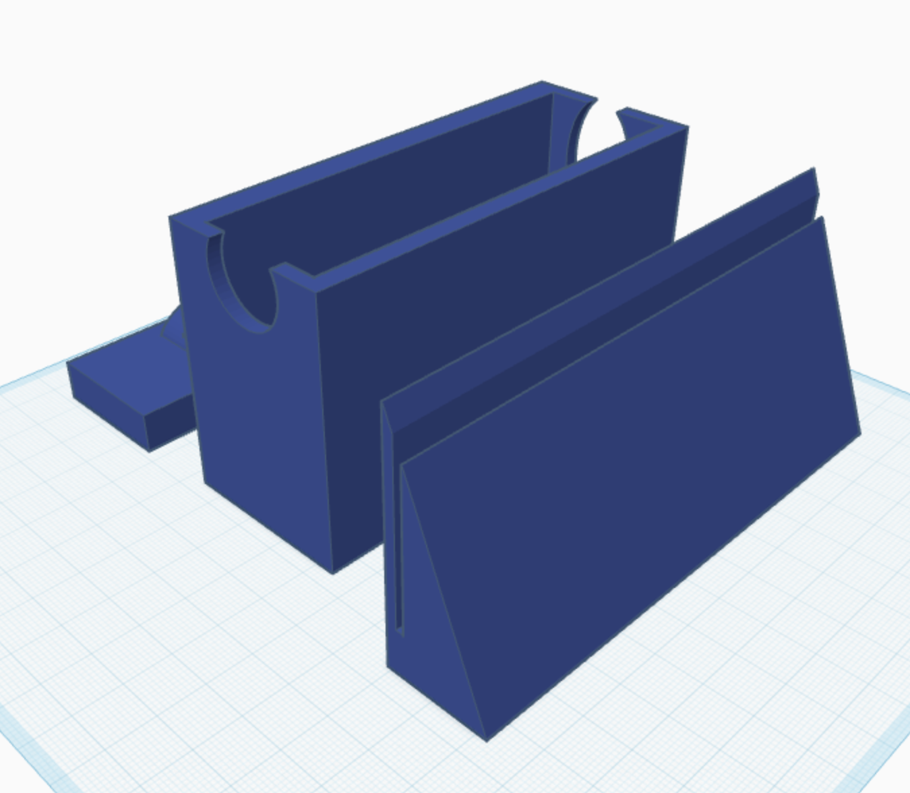

# The Zipperer!!
---
Our device aims to solve an eternal issue: trying to zip up the back of your dress to no avail. Using a geared motor system, we created an automated zipper pull-up system that allows you to zip up the backs of your clothes without any one else's help. Using a DC motor, several gears, a cord, and a repurposed clip, our mechanism clips onto the back of your collar and attaches to the zipper of your clothing item, and winds up the cord to close the back of your clothing. Using 3D printing, we created a custon case labeled "Zipperer" that holds the controller for the device, and another case for the motor to clip to your dressing item.
---
# Images:
  
  

---

Bill of Materials (BOM):
- 3D printed parts (case for remote, case for motor)
- 28BYJ-48 - 5V Stepper Motor (https://components101.com/motors/28byj-48-stepper-motor)
- 3 Position DPDT Panel Slide Switch (https://www.amazon.com/Uxcell-Position-Panel-Slide-Switch/dp/B019MO5S1K?source=ps-sl-shoppingads-lpcontext&ref_=fplfs&psc=1&smid=ATVPDKIKX0DER&gQT=1)
- Cord / Twine (https://www.homedepot.com/p/T-W-Evans-Cordage-3-Ply-12900-ft-100-Cotton-Twine-Cone-06-030/205326703?source=shoppingads&locale=en-US&srsltid=AfmBOor6ZrGJVLZUvsXxWOit0RiNPvwNbhb2PADlooVIjyLncgbMMJh8vUM&gQT=1)
- Alligator Clip (https://www.officedepot.com/a/products/660706/Office-Depot-Brand-Swivel-Alligator-Clip/?utm_source=google&utm_medium=sag&srsltid=AfmBOooJ8bYqyPSKX_gHirGAV4fKKEsvVFlz0kzU9wKukUvDWGfCS8Ey_HI&region_id=001135&gQT=1)

